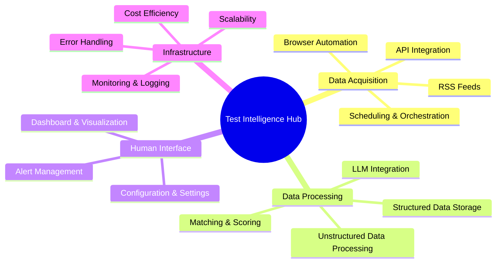
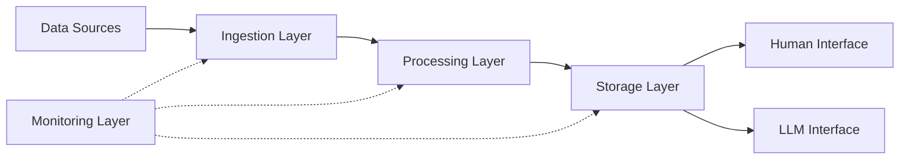

### Was ist Markdown?

Markdown ist eine leichtgewichtige Auszeichnungssprache, die Sie verwenden können, um einfache Textdokumente zu formatieren.
Schreiben Sie Dokumente für Ihre GitHub-Projekte, bearbeiten Sie Ihr GitHub-Profil _README_ usw. All das finden Sie hier.

Tauchen wir ein. ⤵️

#### Inhaltsverzeichnis

1. [Absatz](#absatz)
2. [Überschriften](#überschriften)
3. [Hervorhebung](#hervorhebung)
4. [Zitatblock](#zitatblock)
5. [Bilder](#bilder)
6. [Links](#links)
7. [Code](#code)
8. [Listen](#listen)
   - [Geordnete Liste](#geordnete-liste)
   - [Ungeordnete Liste](#ungeordnete-liste)
   - [Gemischte Liste](#gemischte-liste)
9. [Tabelle](#tabelle)
10. [Aufgabenliste](#aufgabenliste)
11. [Fußnote](#fußnote)
12. [Zum Abschnitt springen](#zum-abschnitt-springen)
13. [Horizontale Linie](#horizontale-linie)
14. [HTML](#html)

---

## Absatz

Indem Sie normalen Text schreiben, schreiben Sie im Grunde einen Absatz.

```
This is a paragraph.
```

This is a paragraph.

---

## Überschriften

Es gibt 6 Überschriftenvarianten. Die Anzahl der „#“-Symbole, gefolgt von Text, zeigt die Wichtigkeit der Überschrift an.

```
# Heading 1
## Heading 2
### Heading 3
#### Heading 4
##### Heading 5
###### Heading 6
```

# Heading 1

## Heading 2

### Heading 3

#### Heading 4

##### Heading 5

###### Heading 6

---

## Hervorhebung

Text zu bearbeiten ist so einfach und praktisch. Sie können Ihren Text fett, kursiv und durchgestrichen formatieren.

```
Using two asterisks **this text is bold**.
Two underscores __work as well__.
Let's make it *italic now*.
You guessed it, _one underscore is also enough_.
Can we combine **_both of that_?** Absolutely.
What if I want to ~~strikethrough~~?
```

Mit zwei Sternchen ist **dieser Text fett**.
Zwei Unterstriche **funktionieren auch**.
Machen wir es _jetzt kursiv_.
Sie haben es erraten, _ein Unterstrich ist auch genug_.
Können wir **_beides kombinieren_?** Absolut.
Was, wenn ich etwas ~~durchstreichen~~ möchte?

---

## Zitatblock

Möchten Sie die Wichtigkeit des Textes betonen? Sagen Sie nichts mehr.

```
> This is a blockquote.
> Want to write on a new line with space between?
>
> > And nested? No problem at all.
> >
> > > PS. you can **style** your text _as you want_.
```

> This is a blockquote.
> Want to write on a new line with space between?
>
> > And nested? No problem at all.
> >
> > > PS. Sie können Ihren Text **formatieren**, _wie Sie möchten_. :

---

## Bilder

Der beste Weg ist, Bilder direkt per Drag & Drop von Ihrem Computer zu ziehen. Sie können auch einen Verweis auf ein Bild erstellen und es auf diese Weise zuweisen. Hier ist die Syntax.

```


[logo]: auto-generated-path-to-file-when-you-upload-image "Hover me"
![error text][logo]
```


[logo]: https://user-images.githubusercontent.com/46372998/212541682-9907aaea-5198-45a9-8961-2acc8a98a0db.png 'Hover me'

![error text][logo]

---

## Links

Ähnlich wie bei Bildern können Links direkt oder durch Erstellen einer Referenz eingefügt werden. Sie können sowohl Inline- als auch Block-Links erstellen.

```
[markdown-cheatsheet]: https://github.com/im-luka/markdown-cheatsheet
[docs]: https://github.com/adam-p/markdown-here

[Like it so far? Follow me on GitHub](https://github.com/im-luka)
[My Markdown Cheatsheet - star it if you like it][markdown-cheatsheet]
Find some great docs [here][docs]
```

[markdown-cheatsheet]: https://github.com/im-luka/markdown-cheatsheet
[docs]: https://github.com/adam-p/markdown-here

[Gefällt es Ihnen bisher? Folgen Sie mir auf GitHub](https://github.com/im-luka)
[Mein Markdown-Spickzettel – markieren Sie ihn mit einem Stern, wenn er Ihnen gefällt][markdown-cheatsheet]
Tolle Dokumente finden Sie [hier][docs]

---

## Code

Sie können sowohl Inline- als auch vollständige Block-Code-Snippets erstellen. Sie können auch die Programmiersprache definieren, die Sie in Ihrem Snippet verwendet haben. Alles durch die Verwendung von Backticks.

````
    Ich habe die Datei `.env` im Stammverzeichnis erstellt.
    Backticks in Backticks? `` `Kein Problem.` ``

    ```
    {
      learning: "Markdown",
      showing: "block code snippet"
    }
    ```

    ```js
    const x = "Block code snippet in JS";
    console.log(x);
    ```
````

Ich habe die Datei `.env` im Stammverzeichnis erstellt.
Backticks in Backticks? `` `Kein Problem.` ``

```
{
  learning: "Markdown",
  showing: "block code snippet"
}
```

```js
const x = 'Block code snippet in JS';
console.log(x);
```

---

## Listen

Wie in HTML können Sie in Markdown sowohl geordnete als auch ungeordnete Listen erstellen.

### Geordnete Liste

```
1. HTML
2. CSS
3. Javascript
4. React
7. I'm Frontend Dev now 👨🏼‍🎨
```

1. HTML
2. CSS
3. Javascript
4. React
5. Ich bin jetzt Frontend-Entwickler 👨🏼‍🎨

### Ungeordnete Liste

```
- Node.js
+ Express
* Nest.js
- Learning Backend ⌛️
```

- Node.js

* Express

- Nest.js

* Backend lernen ⌛️

### Gemischte Liste

Sie können auch beide Listen mischen und Unterlisten erstellen.
**PS.** Versuchen Sie, Listen nicht tiefer als zwei Ebenen zu erstellen. Das ist die beste Vorgehensweise.

```
1. Learn Basics
   1. HTML
   2. CSS
   7. Javascript
2. Learn One Framework
   - React
     - Router
     - Redux
   * Vue
   + Svelte
```

1. Learn Basics
   1. HTML
   2. CSS
   3. Javascript
2. Learn One Framework
   - React
     - Router
     - Redux
   * Vue
   - Svelte

---

## Tabelle

Eine großartige Möglichkeit, gut geordnete Daten anzuzeigen. Verwenden Sie das „|“-Symbol, um Spalten zu trennen, und das „:“-Symbol, um den Zeileninhalt auszurichten.

```
| Left Align (default) | Center Align | Right Align |
| :------------------- | :----------: | ----------: |
| React.js             | Node.js      | MySQL       |
| Next.js              | Express      | MongoDB     |
| Vue.js               | Nest.js      | Redis       |
```

| Linksbündig (Standard) | Zentriert | Rechtsbündig |
| :------------------- | :----------: | ----------: |
| React.js             |   Node.js    |       MySQL |
| Next.js              |   Express    |     MongoDB |
| Vue.js               |   Nest.js    |       Redis |

---

## Aufgabenliste

Den Überblick über erledigte und noch zu erledigende Aufgaben behalten.

```
- [x] Learn Markdown
- [ ] Learn Frontend Development
- [ ] Learn Full Stack Development
```

- [x] Markdown lernen
- [ ] Frontend-Entwicklung lernen
- [ ] Full-Stack-Entwicklung lernen

---

## Fußnote

Möchten Sie etwas am Ende der Datei beschreiben? Verwenden Sie eine Fußnote!

```
#### I am working on a new project. [^1]
[^1]: Stack is: React, Typescript, Tailwind CSS

Project is about music & movies.

##### Hope you will like it. [^see]
[^see]: Loading... ⌛️
```

#### Ich arbeite an einem neuen Projekt. [^1]

[^1]: Der Stack ist: React, Typescript, Tailwind CSS

Das Projekt handelt von Musik & Filmen.

##### Ich hoffe, es wird Ihnen gefallen. [^see]

[^see]: Wird geladen... ⌛️

---

## Zum Abschnitt springen

Astro (und die meisten Markdown-Parser) generieren automatisch IDs für Ihre Überschriften. Sie müssen normalerweise keine manuellen `<a name="...">`-Tags erstellen.

---

## Horizontale Linie

Sie können Sternchen, Bindestriche oder Unterstriche (\*, -, \_) verwenden, um eine horizontale Linie zu erstellen. Die einzige Regel ist, dass Sie mindestens drei Zeichen des Symbols verwenden müssen.

```
First Horizontal Line

***

Second One

-----

Third

_________
```

Erste horizontale Linie

---

Zweite

---

Dritte

---

---

## HTML

Sie können auch reines HTML in Ihrer Markdown-Datei verwenden. Meistens funktioniert das gut, aber manchmal kann es zu Unterschieden kommen, die Sie bei der Arbeit mit Standard-HTML nicht gewohnt sind. Die Verwendung von CSS funktioniert nicht.

```
<h1>This is a heading</h1>
<p>Paragraph...</p>

<hr />


<a href="https://github.com/im-luka">Follow me on GitHub</a>

<br />
<br />

<p>Quick hack for <strong><em>centering image</em></strong>?</p>
<p align="center"></p>

<details>
  <summary>One more quick hack? 🎭</summary>

  → Easy
  → And simple
</details>
```

<h1>Dies ist eine Überschrift</h1>
<p>Absatz...</p>

<hr />


<a href="https://github.com/im-luka">Folgen Sie mir auf GitHub</a>

<br />
<br />

<p>Schneller Trick zum **_Zentrieren von Bildern_**?</p>
<p align="center"></p>

<details>
  <summary>Noch ein schneller Trick? 🎭</summary>
  
  → Einfach  
  → Und simpel
</details>

---

## Mermaid-Diagramme

### Mindmap



### Flussdiagramm



---

##### Abschnitt mit einer ID
