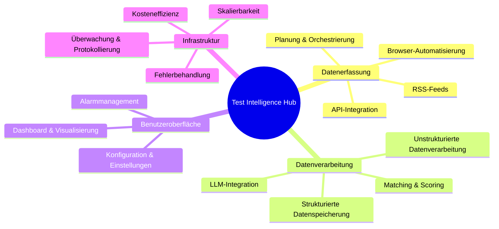

### Was ist Markdown?

Markdown ist eine schlanke Auszeichnungssprache, mit der du reine Textdokumente formatieren kannst.  
Schreibe Dokumente für deine GitHub-Projekte, bearbeite dein GitHub-Profil, die _README_-Datei usw. Hier findest du alles dazu.

Lass uns loslegen. ⤵️

#### Inhaltsverzeichnis

1. [Absatz](#paragraph)
2. [Überschriften](#headings)
3. [Hervorhebung](#emphasis)
4. [Blockzitat](#blockquote)
5. [Bilder](#images)
6. [Links](#links)
7. [Code](#code)
8. [Listen](#lists)
   - [Nummerierte Liste](#orderedlist)
   - [Unnummerierte Liste](#unorderedlist)
   - [Gemischte Liste](#mixedlist)
9. [Tabelle](#table)
10. [Aufgabenliste](#tasklist)
11. [Fußnote](#footnote)
12. [Zum Abschnitt springen](#sectionjump)
13. [Horizontale Linie](#horizontalline)
14. [HTML](#html)

---

## Absatz

Wenn du normalen Text schreibst, verfasst du im Grunde einen Absatz.

```
Dies ist ein Absatz.
```

Dies ist ein Absatz.

---

## Überschriften

Es gibt 6 Überschriftenvarianten. Die Anzahl der „#“-Symbole, gefolgt von Text, gibt die Wichtigkeit der Überschrift an.

```
# Überschrift 1
## Überschrift 2
### Überschrift 3
#### Überschrift 4
##### Überschrift 5
###### Überschrift 6
```

# Überschrift 1

## Überschrift 2

### Überschrift 3

#### Überschrift 4

##### Überschrift 5

###### Überschrift 6

---

## Hervorhebungen

Das Bearbeiten von Text ist ganz einfach. Du kannst deinen Text fett, kursiv und durchgestrichen formatieren.

```
Mit zwei Sternchen **wird dieser Text fett**.
Zwei Unterstriche __funktionieren ebenfalls__.
Machen wir ihn jetzt *kursiv*.
Du hast es erraten, _ein Unterstrich reicht auch_.
Können wir **_beides_** kombinieren? Auf jeden Fall.
Was ist, wenn ich ~~durchstreichen~~ möchte?
```

Mit zwei Sternchen **ist dieser Text fett**.  
Zwei Unterstriche **funktionieren ebenfalls**.  
Machen wir ihn jetzt _kursiv_.  
Du hast es erraten, _ein Unterstrich reicht auch_.  
Können wir **_beides_ kombinieren?** Auf jeden Fall.  
Was ist, wenn ich ~~durchstreichen~~ möchte?

---

## Blockzitat

Möchtest du die Wichtigkeit des Textes hervorheben? Mehr musst du nicht sagen.

```
&gt; Dies ist ein Blockzitat.
&gt; Möchtest du in einer neuen Zeile mit Abstand dazwischen schreiben?
&gt;
&gt; &gt; Und verschachtelt? Kein Problem.
&gt; &gt;
&gt; &gt; &gt; PS. Du kannst deinen Text **gestalten**, _wie du willst_.
```

&gt; Dies ist ein Blockzitat.
&gt; Möchten Sie in einer neuen Zeile mit Abstand dazwischen schreiben?
&gt;
&gt; &gt; Und verschachtelt? Kein Problem.
&gt; &gt;
&gt; &gt; &gt; PS. Sie können Ihren Text **gestalten**, _wie Sie wollen_. :

---

## Bilder

Am besten ziehen Sie das Bild einfach direkt von Ihrem Computer per Drag &amp; Drop hinein. Sie können auch einen Verweis auf das Bild erstellen und es auf diese Weise zuweisen.  
Hier ist die Syntax.

```


[Logo]: automatisch-generierter-Pfad-zur-Datei-beim-Hochladen-des-Bildes &quot;Fahre mit der Maus darüber&quot;
![Fehlertext][logo]
```


[Logo]: https://user-images.githubusercontent.com/46372998/212541682-9907aaea-5198-45a9-8961-2acc8a98a0db.png &#x27;Hover me&#x27;

![Fehlertext][Logo]

---

## Links

Ähnlich wie Bilder können auch Links direkt oder durch Erstellen eines Verweises eingefügt werden. Du kannst sowohl Inline- als auch Block-Links erstellen.

```
[markdown-cheatsheet]: https://github.com/im-luka/markdown-cheatsheet
[docs]: https://github.com/adam-p/markdown-here

[Gefällt es dir bisher? Folge mir auf GitHub](https://github.com/im-luka)
[Mein Markdown-Spickzettel – mit einem Stern markieren, wenn er dir gefällt][markdown-cheatsheet]
Hier findest du tolle Dokumentationen [hier][docs]
```

[markdown-cheatsheet]: https://github.com/im-luka/markdown-cheatsheet
[docs]: https://github.com/adam-p/markdown-here

[Gefällt es dir bisher? Folge mir auf GitHub](https://github.com/im-luka)  
[Mein Markdown-Spickzettel – mit einem Stern markieren, wenn es dir gefällt][markdown-cheatsheet]  
Hier findest du tolle Dokumentationen [hier][docs]

---

## Code

Du kannst sowohl Inline- als auch vollständige Block-Code-Schnipsel erstellen. Du kannst auch die Programmiersprache definieren, die du in deinem Schnipsel verwendest. Alles mithilfe von Backticks.

````
    Ich habe eine `.env`-Datei im Stammverzeichnis erstellt.
    Backticks innerhalb von Backticks? `` `Kein Problem.` ``

    ```
    {
      learning: &quot;Markdown&quot;,
      showing: &quot;Block-Code-Schnipsel&quot;
    }
    ```

    ```js
    const x = &quot;Block-Code-Schnipsel in JS&quot;;
    console.log(x);
    ```
````

Ich habe die Datei `.env` im Stammverzeichnis erstellt.
Backticks innerhalb von Backticks? `` `Kein Problem.` ``

```
{
  learning: &quot;Markdown&quot;,
  showing: &quot;Block code snippet&quot;
}
```

```js
const x = &#x27;Block code snippet in JS&#x27;;
console.log(x);
```

---

## Listen

Genau wie in HTML ermöglicht Markdown das Erstellen von nummerierten und unnummerierten Listen.

### Nummerierte Liste

```
1. HTML
2. CSS
3. Javascript
4. React
7. Ich bin jetzt Frontend-Entwickler 👨🏼‍🎨
```

1. HTML
2. CSS
3. Javascript
4. React
5. Ich bin jetzt Frontend-Entwickler 👨🏼‍🎨

### Ungeordnete Liste

```
- Node.js
+ Express
* Nest.js
- Backend lernen ⌛️
```

- Node.js

* Express

- Nest.js

* Backend lernen ⌛️

### Gemischte Liste

Du kannst auch beide Listen mischen und Unterlisten erstellen.  
**PS.** Versuche, keine Listen mit mehr als zwei Ebenen zu erstellen. Das ist die beste Vorgehensweise.

```
1. Grundlagen lernen
   1. HTML
   2. CSS
   7. JavaScript
2. Ein Framework lernen
   - React
     - Router
     - Redux
   * Vue
   + Svelte
```

1. Grundlagen lernen
   1. HTML
   2. CSS
   3. JavaScript
2. Ein Framework lernen
   - React
     - Router
     - Redux
   * Vue
   - Svelte

---

## Tabelle

Eine hervorragende Möglichkeit, Daten übersichtlich darzustellen. Verwende das Symbol „|“ zum Trennen von Spalten und das Symbol „:“ zum Ausrichten von Zeileninhalten.

```
| Linksbündig (Standard) | Zentriert | Rechtsbündig |
| :------------------- | :----------: | ----------: |
| React.js             | Node.js      | MySQL       |
| Next.js              | Express      | MongoDB     |
| Vue.js               | Nest.js      | Redis       |
```

| Linksbündig (Standard) | Zentriert | Rechtsbündig |
| :------------------- | :----------: | ----------: |
| React.js             |   Node.js    |       MySQL |
| Next.js              |   Express    |     MongoDB |
| Vue.js               |   Nest.js    |       Redis |

---

## Aufgabenliste

Behalte den Überblick über erledigte und noch zu erledigende Aufgaben.

```
- [x] Markdown lernen
- [ ] Frontend-Entwicklung lernen
- [ ] Full-Stack-Entwicklung lernen
```

- [x] Markdown lernen
- [ ] Frontend-Entwicklung lernen
- [ ] Full-Stack-Entwicklung lernen

---

## Fußnote

Möchtest du am Ende der Datei etwas beschreiben? Verwende eine Fußnote!

```
#### Ich arbeite an einem neuen Projekt. [^1]
[^1]: Der Stack besteht aus: React, Typescript, Tailwind CSS

Das Projekt dreht sich um Musik und Filme.

##### Ich hoffe, es gefällt dir. [^see]
[^see]: Wird geladen... ⌛️
```

#### Ich arbeite an einem neuen Projekt. [^1]

[^1]: Der Stack besteht aus: React, Typescript, Tailwind CSS

Das Projekt dreht sich um Musik und Filme.

##### Ich hoffe, es gefällt dir. [^see]

[^siehe]: Wird geladen... ⌛️

---

## Zum Abschnitt springen

Astro (und die meisten Markdown-Parser) generieren automatisch IDs für deine Überschriften. Du musst normalerweise keine manuellen `<a name="...">
`-Tags</a> erstellen<a name="...">
.

---

## Horizontale Linie

Du kannst Sternchen, Bindestriche oder Unterstriche (\*, -, \_) verwenden, um eine horizontale Linie zu erstellen.  
Die einzige Regel ist, dass du mindestens drei Zeichen des Symbols verwenden musst.

```
Erste horizontale Linie

***

Zweite

-----

Dritte

_________
```

Erste horizontale Linie

---

Zweite

---

Dritte

---

---

## HTML

Sie können in Ihrer Markdown-Datei auch reines HTML verwenden. Meistens funktioniert das gut, aber manchmal können Unterschiede auftreten, die Sie von der Arbeit mit Standard-HTML nicht gewohnt sind. Die Verwendung von CSS funktioniert nicht.

```
<h1>Dies ist eine Überschrift</h1>
<p>Absatz...</p>

<hr />


<a href="https://github.com/im-luka">Folgen Sie mir auf GitHub</a>

<br />
<br />

<p>Ein schneller Trick, um <strong><em>ein Bild zu zentrieren</em></strong>?</p>
<p align="center"></p>

<details>
  <summary>Noch ein schneller Trick? 🎭</summary>

  → Einfach
  → Und unkompliziert
</details>
```

<h1>Dies ist eine Überschrift</h1>
<p>Absatz...</p>

<hr />


<a href="https://github.com/im-luka">Folgen Sie mir auf GitHub</a>
---

<br />
<br />

<p>Schneller Trick zum <strong><em>Zentrieren eines Bildes</em></strong>?</p>
<p align="center"></p>

<details>
  <summary>Noch ein schneller Hack? 🎭</summary>
  
  → Einfach  
  → Und simpel
</details>


## Mermaid-Diagramme

### Mindmap



### Flussdiagramm

```mermaid
flowchart LR
    A[Datenquellen] --&gt; B[Erfassungsschicht]
    B --&gt; C[Verarbeitungsschicht]
    C --&gt; D[Speicherschicht]
    D --&gt; E[Benutzeroberfläche]
    D --&gt; F[LLM-Schnittstelle]
    G[Überwachungsschicht] -.-&gt; B
    G -.-&gt; C
    G -.-&gt; D
```

---

##### Abschnitt mit einer ID</a>
