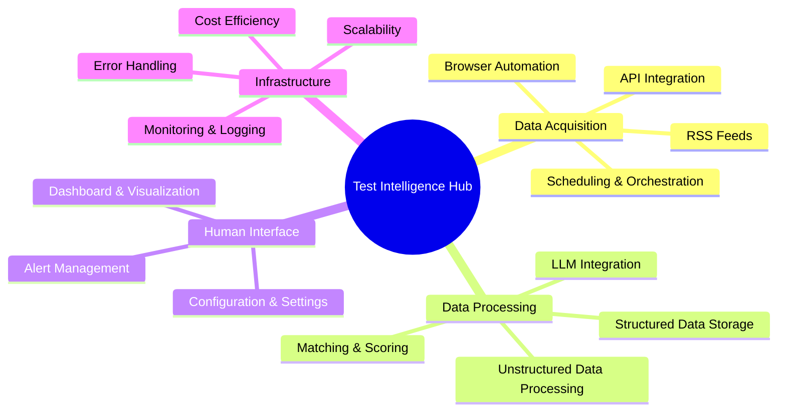
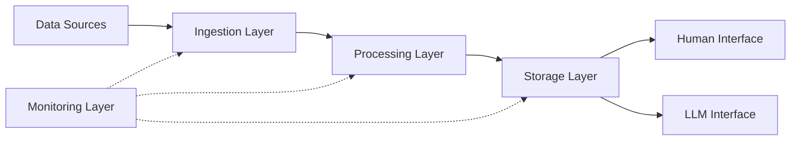

### ¿Qué es Markdown?

Markdown es un lenguaje de marcado ligero que puedes usar para formatear documentos de texto sin formato.
Escribe documentos para tus proyectos de GitHub, edita el archivo _README_ de tu perfil de GitHub, etc. Lo encontrarás todo aquí.

Vamos a profundizar. ⤵️

#### Tabla de Contenidos

1. [Párrafo](#paragraph)
2. [Encabezados](#headings)
3. [Énfasis](#emphasis)
4. [Cita en bloque](#blockquote)
5. [Imágenes](#images)
6. [Enlaces](#links)
7. [Código](#code)
8. [Listas](#lists)
   - [Lista Ordenada](#orderedlist)
   - [Lista No Ordenada](#unorderedlist)
   - [Lista Mixta](#mixedlist)
9. [Tabla](#table)
10. [Lista de Tareas](#tasklist)
11. [Nota al Pie](#footnote)
12. [Saltar a sección](#sectionjump)
13. [Línea Horizontal](#horizontalline)
14. [HTML](#html)

---

## Párrafo

Al escribir texto normal, básicamente estás escribiendo un párrafo.

```
This is a paragraph.
```

Esto es un párrafo.

---

## Encabezados

Hay 6 variantes de encabezado. El número de símbolos "#", seguido de texto, indica la importancia del encabezado.

```
# Heading 1
## Heading 2
### Heading 3
#### Heading 4
##### Heading 5
###### Heading 6
```

# Heading 1

## Heading 2

### Heading 3

#### Heading 4

##### Heading 5

###### Heading 6

---

## Énfasis

Modificar texto es muy ordenado y fácil. Puedes poner tu texto en negrita, cursiva y tachado.

```
Using two asterisks **this text is bold**.
Two underscores __work as well__.
Let's make it *italic now*.
You guessed it, _one underscore is also enough_.
Can we combine **_both of that_?** Absolutely.
What if I want to ~~strikethrough~~?
```

Usando dos asteriscos **este texto está en negrita**.
Dos guiones bajos **también funcionan**.
Pongámoslo _en cursiva ahora_.
Lo has adivinado, _un guion bajo también es suficiente_.
¿Podemos combinar **_ambos_?** Absolutamente.
¿Y si quiero ~~tachar~~?

---

## Cita en bloque

¿Quieres enfatizar la importancia del texto? No digas más.

```
> This is a blockquote.
> Want to write on a new line with space between?
>
> > And nested? No problem at all.
> >
> > > PS. you can **style** your text _as you want_.
```

> Esto es una cita en bloque.
> ¿Quieres escribir en una nueva línea con espacio?
>
> > ¿Y anidado? No hay problema.
> >
> > > PD. puedes **estilizar** tu texto _como quieras_. :

---

## Imágenes

La mejor manera es simplemente arrastrar y soltar la imagen directamente desde tu ordenador. También puedes crear una referencia a la imagen y asignarla de esa manera.
Aquí está la sintaxis.

```


[logo]: auto-generated-path-to-file-when-you-upload-image "Hover me"
![error text][logo]
```


[logo]: https://user-images.githubusercontent.com/46372998/212541682-9907aaea-5198-45a9-8961-2acc8a98a0db.png 'Pasa el ratón'

![texto de error][logo]

---

## Enlaces

Similar a las imágenes, los enlaces también pueden insertarse directamente o creando una referencia. Puedes crear enlaces tanto en línea como en bloque.

```
[markdown-cheatsheet]: https://github.com/im-luka/markdown-cheatsheet
[docs]: https://github.com/adam-p/markdown-here

[Like it so far? Follow me on GitHub](https://github.com/im-luka)
[My Markdown Cheatsheet - star it if you like it][markdown-cheatsheet]
Find some great docs [here][docs]
```

[markdown-cheatsheet]: https://github.com/im-luka/markdown-cheatsheet
[docs]: https://github.com/adam-p/markdown-here

[¿Te gusta hasta ahora? Sígueme en GitHub](https://github.com/im-luka)
[Mi Hoja de Trucos de Markdown - dale una estrella si te gusta][markdown-cheatsheet]
Encuentra buena documentación [aquí][docs]

---

## Código

Puedes crear tanto fragmentos de código en línea como bloques de código completos. También puedes definir el lenguaje de programación que utilizaste en tu fragmento. Todo usando tildes inversas.

````
    I created `.env` file at the root.
    Backticks inside backticks? `` `No problem.` ``

    ```
    {
      learning: "Markdown",
      showing: "block code snippet"
    }
    ```

    ```js
    const x = "Block code snippet in JS";
    console.log(x);
    ```
````

Creé el archivo `.env` en la raíz.
¿Tildes inversas dentro de tildes inversas? `` `No problem.` ``

```
{
  learning: "Markdown",
  showing: "block code snippet"
}
```

```js
const x = 'Block code snippet in JS';
console.log(x);
```

---

## Listas

Como puedes hacer en HTML, Markdown permite la creación de listas ordenadas y no ordenadas.

### Lista Ordenada

```
1. HTML
2. CSS
3. Javascript
4. React
7. I'm Frontend Dev now 👨🏼‍🎨
```

1. HTML
2. CSS
3. Javascript
4. React
5. Ahora soy Desarrollador Frontend 👨🏼‍🎨

### Lista No Ordenada

```
- Node.js
+ Express
* Nest.js
- Learning Backend ⌛️
```

- Node.js

* Express

- Nest.js

* Aprendiendo Backend ⌛️

### Lista Mixta

También puedes mezclar ambos tipos de listas y crear sublistas.
**PD.** Intenta no crear listas con más de dos niveles de profundidad. Es la mejor práctica.

```
1. Learn Basics
   1. HTML
   2. CSS
   7. Javascript
2. Learn One Framework
   - React
     - Router
     - Redux
   * Vue
   + Svelte
```

1. Aprender lo Básico
   1. HTML
   2. CSS
   3. Javascript
2. Aprender un Framework
   - React
     - Router
     - Redux
   * Vue
   - Svelte

---

## Tabla

Excelente manera de mostrar datos bien organizados. Usa el símbolo "|" para separar columnas y el símbolo ":" para alinear el contenido de las filas.

```
| Left Align (default) | Center Align | Right Align |
| :------------------- | :----------: | ----------: |
| React.js             | Node.js      | MySQL       |
| Next.js              | Express      | MongoDB     |
| Vue.js               | Nest.js      | Redis       |
```

| Alineación Izquierda (predeterminado) | Alineación Central | Alineación Derecha |
| :----------------------------------- | :----------------: | -----------------: |
| React.js                             |      Node.js       |              MySQL |
| Next.js                              |      Express       |            MongoDB |
| Vue.js                               |      Nest.js       |              Redis |

---

## Lista de Tareas

Llevando un registro de las tareas que están hechas y las que quedan por hacer.

```
- [x] Learn Markdown
- [ ] Learn Frontend Development
- [ ] Learn Full Stack Development
```

- [x] Aprender Markdown
- [ ] Aprender Desarrollo Frontend
- [ ] Aprender Desarrollo Full Stack

---

## Nota al Pie

¿Quieres describir algo al final del archivo? ¡Usa una nota al pie!

```
#### I am working on a new project. [^1]
[^1]: Stack is: React, Typescript, Tailwind CSS

Project is about music & movies.

##### Hope you will like it. [^see]
[^see]: Loading... ⌛️
```

#### Estoy trabajando en un nuevo proyecto. [^1]

[^1]: La pila es: React, Typescript, Tailwind CSS

El proyecto trata sobre música y películas.

##### Espero que te guste. [^see]

[^see]: Cargando... ⌛️

---

## Saltar a sección

Astro (y la mayoría de los analizadores Markdown) genera automáticamente IDs para tus encabezados. Normalmente no necesitas crear etiquetas `<a name="...">` manuales.

---

## Línea Horizontal

Puedes usar asteriscos, guiones o guiones bajos (\*, -, \_) para crear una línea horizontal.
La única regla es que debes incluir al menos tres caracteres del símbolo.

```
First Horizontal Line

***

Second One

-----

Third

_________
```

Primera Línea Horizontal

---

Segunda

---

Tercera

---

---

## HTML

También puedes usar HTML puro en tu archivo Markdown. La mayoría de las veces funcionará bien, pero a veces puedes experimentar algunas diferencias a las que no estás acostumbrado cuando trabajas con HTML estándar. Usar CSS no funcionará.

```
<h1>This is a heading</h1>
<p>Paragraph...</p>

<hr />


<a href="https://github.com/im-luka">Follow me on GitHub</a>

<br />
<br />

<p>Quick hack for <strong><em>centering image</em></strong>?</p>
<p align="center"></p>

<details>
  <summary>One more quick hack? 🎭</summary>

  → Easy
  → And simple
</details>
```

<h1>This is a heading</h1>
<p>Paragraph...</p>

<hr />


<a href="https://github.com/im-luka">Follow me on GitHub</a>

<br />
<br />

<p>Quick hack for <strong><em>centering image</em></strong>?</p>
<p align="center"></p>

<details>
  <summary>One more quick hack? 🎭</summary>
  
  → Easy  
  → And simple
</details>

---

## Diagramas Mermaid

### Mapa Mental



### Diagrama de Flujo



---

##### Sección con alguna ID
