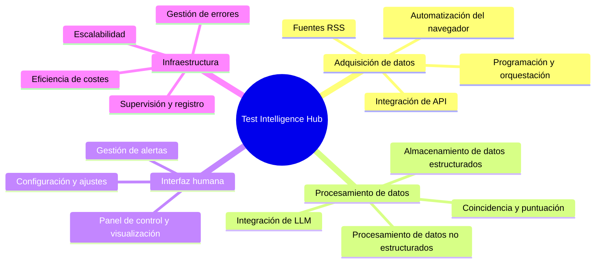

### ¿Qué es Markdown?

Markdown es un lenguaje de marcado ligero que puedes usar para dar formato a documentos de texto sin formato.  
Escribe documentos para tus proyectos de GitHub, edita tu perfil de GitHub, el archivo _README_, etc. Lo encontrarás todo aquí.

Vamos a profundizar en ello. ⤵️

#### Índice

1. [Párrafo](#párrafo)
2. [Encabezados](#encabezados)
3. [Énfasis](#énfasis)
4. [Cita destacada](#cita_destacada)
5. [Imágenes](#imágenes)
6. [Enlaces](#links)
7. [Código](#code)
8. [Listas](#lists)
   - [Lista ordenada](#orderedlist)
   - [Lista desordenada](#unorderedlist)
   - [Lista mixta](#mixedlist)
9. [Tabla](#table)
10. [Lista de tareas](#tasklist)
11. [Nota al pie](#footnote)
12. [Ir a la sección](#sectionjump)
13. [Línea horizontal](#horizontalline)
14. [HTML](#html)

---

## Párrafo

Al escribir texto normal, básicamente estás escribiendo un párrafo.

```
Este es un párrafo.
```

Esto es un párrafo.

---

## Encabezados

Hay 6 variantes de encabezado. El número de símbolos «#», seguidos de texto, indica la importancia del encabezado.

```
# Encabezado 1
## Encabezado 2
### Encabezado 3
#### Encabezado 4
##### Encabezado 5
###### Encabezado 6
```

# Encabezado 1

## Encabezado 2

### Encabezado 3

#### Encabezado 4

##### Encabezado 5

###### Encabezado 6

---

## Énfasis

Modificar el texto es muy sencillo y fácil. Puedes poner el texto en negrita, cursiva y tachado.

```
Usando dos asteriscos **este texto aparece en negrita**.
Dos guiones bajos __también funcionan__.
Ahora pongámoslo *en cursiva*.
Lo has adivinado, _un guión bajo también es suficiente_.
¿Podemos combinar **_ambas cosas_?** Por supuesto.
¿Y si quiero ~~tacharlo~~?
```

Usando dos asteriscos **este texto está en negrita**.  
Dos guiones bajos **también funcionan**.  
Ahora pongámoslo _en cursiva_.  
Lo has adivinado, _un guión bajo también es suficiente_.  
¿Podemos combinar **_ambas cosas_?** Por supuesto.  
¿Y si quiero ~~tacharlo~~?

---

## Cita

¿Quieres destacar la importancia del texto? No digas más.

```
&gt; Esto es una cita.
&gt; ¿Quieres escribir en una nueva línea con espacio entre líneas?
&gt;
&gt; &gt; ¿Y anidada? No hay ningún problema.
&gt; &gt;
&gt; &gt; &gt; PD: puedes **dar estilo** a tu texto _como quieras_.
```

&gt; Esto es una cita.
&gt; ¿Quieres escribir en una nueva línea con espacio entre líneas?
&gt;
&gt; &gt; ¿Y anidado? No hay ningún problema.
&gt; &gt;
&gt; &gt; &gt; PD: puedes **darle estilo** a tu texto _como quieras_. :

---

## Imágenes

La mejor forma es simplemente arrastrar y soltar la imagen directamente desde tu ordenador. También puedes crear una referencia a la imagen y asignarla de esa manera.  
Aquí tienes la sintaxis.

```


[logotipo]: ruta-automática-al-archivo-al-subir-la-imagen &quot;Pasa el cursor por aquí&quot;
![texto de error][logotipo]
```


[logotipo]: https://user-images.githubusercontent.com/46372998/212541682-9907aaea-5198-45a9-8961-2acc8a98a0db.png &#x27;Pasa el cursor por aquí&#x27;

![texto de error][logotipo]

---

## Enlaces

Al igual que las imágenes, los enlaces también se pueden insertar directamente o creando una referencia. Puedes crear tanto enlaces en línea como de bloque.

```
[markdown-cheatsheet]: https://github.com/im-luka/markdown-cheatsheet
[docs]: https://github.com/adam-p/markdown-here

[¿Te gusta lo que has visto hasta ahora? Sígueme en GitHub](https://github.com/im-luka)
[Mi hoja de referencia de Markdown: márcala con una estrella si te gusta][markdown-cheatsheet]
Encuentra documentación excelente [aquí][docs]
```

[markdown-cheatsheet]: https://github.com/im-luka/markdown-cheatsheet
[docs]: https://github.com/adam-p/markdown-here

[¿Te gusta lo que has visto hasta ahora? Sígueme en GitHub](https://github.com/im-luka)  
[Mi hoja de referencia de Markdown: añádela a tus favoritos si te gusta][markdown-cheatsheet]  
Encuentra excelentes documentos [aquí][docs]

---

## Código

Puedes crear fragmentos de código tanto en línea como en bloques completos. También puedes definir el lenguaje de programación que estás utilizando en tu fragmento. Todo ello utilizando comillas invertidas.

````
    He creado un archivo `.env` en la raíz.
    ¿Comillas invertidas dentro de comillas invertidas? `` `No hay problema.` ``

    ```
    {
      learning: &quot;Markdown&quot;,
      showing: &quot;fragmento de código en bloque&quot;
    }
    ```

    ```js
    const x = &quot;Fragmento de código en bloque en JS&quot;;
    console.log(x);
    ```
````

He creado un archivo `.env` en la raíz.
¿Comillas invertidas dentro de comillas invertidas? `` `No hay problema.` ``

```
{
  learning: &quot;Markdown&quot;,
  showing: &quot;fragmento de código en bloque&quot;
}
```

```js
const x = &#x27;Fragmento de código en bloque en JS&#x27;;
console.log(x);
```

---

## Listas

Al igual que en HTML, Markdown permite crear listas tanto ordenadas como desordenadas.

### Lista ordenada

```
1. HTML
2. CSS
3. Javascript
4. React
7. Ahora soy desarrollador frontend 👨🏼‍🎨
```

1. HTML
2. CSS
3. Javascript
4. React
5. Ahora soy desarrollador front-end 👨🏼‍🎨

### Lista sin ordenar

```
- Node.js
+ Express
* Nest.js
- Aprendiendo backend ⌛️
```

- Node.js

* Express

- Nest.js

* Aprendiendo backend ⌛️

### Lista mixta

También puedes mezclar ambas listas y crear sublistas.  
**PD.** Intenta no crear listas con más de dos niveles de profundidad. Es la mejor práctica.

```
1. Aprender lo básico
   1. HTML
   2. CSS
   7. JavaScript
2. Aprender un framework
   - React
     - Router
     - Redux
   * Vue
   + Svelte
```

1. Aprende los conceptos básicos
   1. HTML
   2. CSS
   3. JavaScript
2. Aprende un framework
   - React
     - Router
     - Redux
   * Vue
   - Svelte

---

## Tabla

Una forma estupenda de mostrar datos bien organizados. Usa el símbolo «|» para separar columnas y el símbolo «:» para alinear el contenido de las filas.

```
| Alineación a la izquierda (predeterminada) | Alineación al centro | Alineación a la derecha |
| :------------------- | :----------: | ----------: |
| React.js             | Node.js      | MySQL       |
| Next.js              | Express      | MongoDB     |
| Vue.js               | Nest.js      | Redis       |
```

| Alineación a la izquierda (predeterminada) | Alineación centrada | Alineación a la derecha |
| :------------------- | :----------: | ----------: |
| React.js             |   Node.js    |       MySQL |
| Next.js              |   Express    |     MongoDB |
| Vue.js               |   Nest.js    |       Redis |

---

## Lista de tareas

Llevar un registro de las tareas que se han completado y de las que quedan por hacer.

```
- [x] Aprender Markdown
- [ ] Aprender desarrollo frontend
- [ ] Aprender desarrollo full stack
```

- [x] Aprender Markdown
- [ ] Aprender desarrollo frontend
- [ ] Aprender desarrollo full stack

---

## Nota al pie

¿Quieres añadir algo al final del archivo? ¡Usa una nota al pie!

```
#### Estoy trabajando en un nuevo proyecto. [^1]
[^1]: El stack es: React, Typescript, Tailwind CSS

El proyecto trata sobre música y películas.

##### Espero que te guste. [^ver]
[^ver]: Cargando... ⌛️
```

#### Estoy trabajando en un nuevo proyecto. [^1]

[^1]: La pila es: React, Typescript, Tailwind CSS

El proyecto trata sobre música y películas.

##### Espero que os guste. [^ver]

[^ver]: Cargando... ⌛️

---

## Saltar a la sección

Astro (y la mayoría de los analizadores de Markdown) genera automáticamente identificadores para tus encabezados. Normalmente no es necesario crear<a name="...">
etiquetas</a> `<a name="...">
`</a> manualmente<a name="...">
.

---

## Línea horizontal

Puedes usar asteriscos, guiones o guiones bajos (\*, -, \_) para crear una línea horizontal.  
La única regla es que debes incluir al menos tres caracteres del símbolo.

```
Primera línea horizontal

***

Segunda

-----

Tercera

_________
```

Primera línea horizontal

---

Segunda

---

Tercera

---

---

## HTML

También puedes utilizar HTML sin formato en tu archivo Markdown. La mayoría de las veces funcionará bien, pero en ocasiones puedes encontrar algunas diferencias a las que no estás acostumbrado al trabajar con HTML estándar. El uso de CSS no funcionará.

```
<h1>Este es un título</h1>
<p>Párrafo...</p>

<hr />


<a href="https://github.com/im-luka">Sígueme en GitHub</a>

<br />
<br />

<p>¿Algún truco rápido para <strong><em>centrar una imagen</em></strong>?</p>
<p align="center"></p>

<details>
  <summary>¿Otro truco rápido? 🎭</summary>

  → Fácil
  → Y sencillo
</details>
```

<h1>Este es un título</h1>
<p>Párrafo...</p>

<hr />


<a href="https://github.com/im-luka">Sígueme en GitHub</a>
---

<br />
<br />

<p>¿Un truco rápido para <strong><em>centrar una imagen</em></strong>?</p>
<p align="center"></p>

<details>
  <summary>¿Otro truco rápido? 🎭</summary>
  
  → Fácil  
  → Y sencillo
</details>


## Diagramas Mermaid

### Mapa mental



### Diagrama de flujo

```mermaid
flowchart LR
    A[Fuentes de datos] --&gt; B[Capa de ingestión]
    B --&gt; C[Capa de procesamiento]
    C --&gt; D[Capa de almacenamiento]
    D --&gt; E[Interfaz humana]
    D --&gt; F[Interfaz LLM]
    G[Capa de monitorización] -.-&gt; B
    G -.-&gt; C
    G -.-&gt; D
```

---

##### Sección con algún ID</a>
