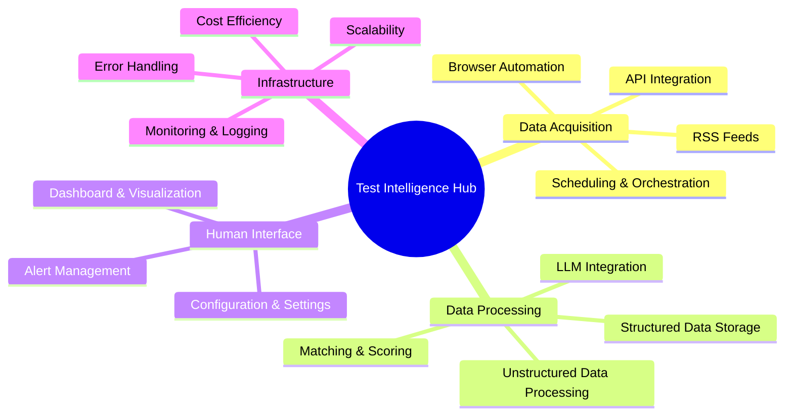
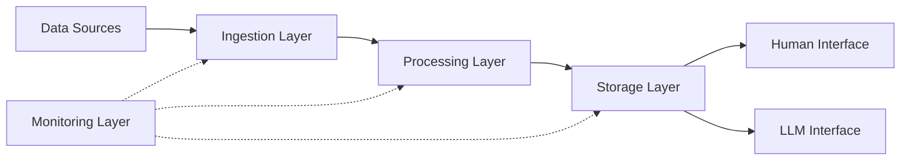

### Qu'est-ce que Markdown ?

Markdown est un langage de balisage léger que vous pouvez utiliser pour formater des documents en texte brut.
Rédigez des documents pour vos projets GitHub, modifiez votre profil GitHub _README_ etc. Vous trouverez tout cela ici.

Plongeons-y. ⤵️

#### Table des Matières

1. [Paragraphe](#paragraph)
2. [Titres](#headings)
3. [Emphase](#emphasis)
4. [Citation](#blockquote)
5. [Images](#images)
6. [Liens](#links)
7. [Code](#code)
8. [Listes](#lists)
   - [Liste Ordonnée](#orderedlist)
   - [Liste Non Ordonnée](#unorderedlist)
   - [Liste Mixte](#mixedlist)
9. [Tableau](#table)
10. [Liste de Tâches](#tasklist)
11. [Note de Bas de Page](#footnote)
12. [Saut de section](#sectionjump)
13. [Ligne Horizontale](#horizontalline)
14. [HTML](#html)

---

## Paragraphe

En écrivant du texte normal, vous écrivez en fait un paragraphe.

```
This is a paragraph.
```

Ceci est un paragraphe.

---

## Titres

Il existe 6 variantes de titres. Le nombre de symboles « # », suivi du texte, indique l'importance du titre.

```
# Heading 1
## Heading 2
### Heading 3
#### Heading 4
##### Heading 5
###### Heading 6
```

# Heading 1

## Heading 2

### Heading 3

#### Heading 4

##### Heading 5

###### Heading 6

---

## Emphase

Modifier le texte est si simple et facile. Vous pouvez mettre votre texte en gras, en italique et le barrer.

```
Using two asterisks **this text is bold**.
Two underscores __work as well__.
Let's make it *italic now*.
You guessed it, _one underscore is also enough_.
Can we combine **_both of that_?** Absolutely.
What if I want to ~~strikethrough~~?
```

En utilisant deux astérisques **ce texte est en gras**.  
Deux tirets bas **fonctionnent aussi bien**.  
Mettons-le *en italique maintenant*.  
Vous l'avez deviné, _un seul tiret bas suffit aussi_.  
Pouvons-nous combiner **_les deux_ ?** Absolument.  
Et si je veux ~~barrer~~ ?

---

## Citation

Envie de souligner l'importance du texte ? N'en dites pas plus.

```
> This is a blockquote.
> Want to write on a new line with space between?
>
> > And nested? No problem at all.
> >
> > > PS. you can **style** your text _as you want_.
```

> Ceci est une citation.
> Vous voulez écrire sur une nouvelle ligne avec un espace entre les deux ?
>
> > Et imbriqué ? Aucun problème.
> >
> > > PS. vous pouvez **styliser** votre texte _comme vous le souhaitez_. :

---

## Images

La meilleure façon est de simplement glisser-déposer l'image directement depuis votre ordinateur. Vous pouvez également créer une référence à l'image et l'attribuer de cette manière.  
Voici la syntaxe.

```


[logo]: auto-generated-path-to-file-when-you-upload-image "Hover me"
![error text][logo]
```


[logo]: https://user-images.githubusercontent.com/46372998/212541682-9907aaea-5198-45a9-8961-2acc8a98a0db.png 'Survolez-moi'

![texte d'erreur][logo]

---

## Liens

Semblable aux images, les liens peuvent également être insérés directement ou en créant une référence. Vous pouvez créer des liens en ligne et des liens de bloc.

```
[markdown-cheatsheet]: https://github.com/im-luka/markdown-cheatsheet
[docs]: https://github.com/adam-p/markdown-here

[Like it so far? Follow me on GitHub](https://github.com/im-luka)
[My Markdown Cheatsheet - star it if you like it][markdown-cheatsheet]
Find some great docs [here][docs]
```

[markdown-cheatsheet]: https://github.com/im-luka/markdown-cheatsheet
[docs]: https://github.com/adam-p/markdown-here

[Ça vous plaît jusqu'à présent ? Suivez-moi sur GitHub](https://github.com/im-luka)  
[Ma Cheatsheet Markdown - mettez une étoile si vous l'aimez][markdown-cheatsheet]  
Trouvez d'excellents documents [ici][docs]

---

## Code

Vous pouvez créer des extraits de code en ligne et des blocs de code complets. Vous pouvez également définir le langage de programmation que vous utilisiez dans votre extrait. Tout cela en utilisant des apostrophes inversées.

````
    I created `.env` file at the root.
    Backticks inside backticks? `` `No problem.` ``

    ```
    {
      learning: "Markdown",
      showing: "block code snippet"
    }
    ```

    ```js
    const x = "Block code snippet in JS";
    console.log(x);
    ```
````

J'ai créé le fichier `.env` à la racine.
Des apostrophes inversées à l'intérieur d'apostrophes inversées ? `` `No problem.` ``

```
{
  learning: "Markdown",
  showing: "block code snippet"
}
```

```js
const x = 'Block code snippet in JS';
console.log(x);
```

---

## Listes

Comme en HTML, Markdown permet de créer des listes ordonnées et non ordonnées.

### Liste Ordonnée

```
1. HTML
2. CSS
3. Javascript
4. React
7. I'm Frontend Dev now 👨🏼‍🎨
```

1. HTML
2. CSS
3. Javascript
4. React
5. Je suis développeur Frontend maintenant 👨🏼‍🎨

### Liste Non Ordonnée

```
- Node.js
+ Express
* Nest.js
- Learning Backend ⌛️
```

- Node.js

* Express

- Nest.js

* Apprentissage du Backend ⌛️

### Liste Mixte

Vous pouvez également mélanger les deux types de listes et créer des sous-listes.  
**PS.** Essayez de ne pas créer de listes de plus de deux niveaux de profondeur. C'est la meilleure pratique.

```
1. Learn Basics
   1. HTML
   2. CSS
   7. Javascript
2. Learn One Framework
   - React
     - Router
     - Redux
   * Vue
   + Svelte
```

1. Apprendre les bases
   1. HTML
   2. CSS
   3. Javascript
2. Apprendre un Framework
   - React
     - Router
     - Redux
   * Vue
   - Svelte

---

## Tableau

Excellent moyen d'afficher des données bien agencées. Utilisez le symbole « | » pour séparer les colonnes et le symbole « : » pour aligner le contenu des lignes.

```
| Left Align (default) | Center Align | Right Align |
| :------------------- | :----------: | ----------: |
| React.js             | Node.js      | MySQL       |
| Next.js              | Express      | MongoDB     |
| Vue.js               | Nest.js      | Redis       |
```

| Alignement à gauche (par défaut) | Alignement au centre | Alignement à droite |
| :----------------------------- | :----------------: | ----------------: |
| React.js                       |      Node.js       |             MySQL |
| Next.js                        |      Express       |           MongoDB |
| Vue.js                         |      Nest.js       |             Redis |

---

## Liste de Tâches

Permet de suivre les tâches accomplies et celles qui restent à faire.

```
- [x] Learn Markdown
- [ ] Learn Frontend Development
- [ ] Learn Full Stack Development
```

- [x] Apprendre Markdown
- [ ] Apprendre le Développement Frontend
- [ ] Apprendre le Développement Full Stack

---

## Note de Bas de Page

Vous voulez décrire quelque chose à la fin du fichier ? Utilisez une note de bas de page !

```
#### I am working on a new project. [^1]
[^1]: Stack is: React, Typescript, Tailwind CSS

Project is about music & movies.

##### Hope you will like it. [^see]
[^see]: Loading... ⌛️
```

#### Je travaille sur un nouveau projet. [^1]

[^1]: La stack est : React, Typescript, Tailwind CSS

Le projet concerne la musique et les films.

##### J'espère que vous l'aimerez. [^see]

[^see]: Chargement... ⌛️

---

## Saut de section

Astro (et la plupart des parseurs Markdown) génère automatiquement des IDs pour vos en-têtes. Vous n'avez généralement pas besoin de créer manuellement des balises `<a name="...">`.

---

## Ligne Horizontale

Vous pouvez utiliser des astérisques, des tirets ou des tirets bas (\*, -, \_) pour créer une ligne horizontale.  
La seule règle est que vous devez inclure au moins trois caractères du symbole.

```
First Horizontal Line

***

Second One

-----

Third

_________
```

Première Ligne Horizontale

---

Seconde

---

Troisième

---

---

## HTML

Vous pouvez également utiliser du HTML brut dans votre fichier Markdown. La plupart du temps, cela fonctionnera bien, mais vous pouvez parfois rencontrer des différences auxquelles vous n'êtes pas habitué lorsque vous travaillez avec du HTML standard. L'utilisation de CSS ne fonctionnera pas.

```
<h1>This is a heading</h1>
<p>Paragraph...</p>

<hr />


<a href="https://github.com/im-luka">Follow me on GitHub</a>

<br />
<br />

<p>Quick hack for <strong><em>centering image</em></strong>?</p>
<p align="center"></p>

<details>
  <summary>One more quick hack? 🎭</summary>

  → Easy
  → And simple
</details>
```

<h1>Ceci est un titre</h1>
<p>Paragraphe...</p>

<hr />


<a href="https://github.com/im-luka">Suivez-moi sur GitHub</a>

<br />
<br />

<p>Astuce rapide pour <strong><em>centrer une image</em></strong> ?</p>
<p align="center"></p>

<details>
  <summary>Une autre astuce rapide ? 🎭</summary>
  
  → Facile  
  → Et simple
</details>

---

## Diagrammes Mermaid

### Carte Mentale



### Organigramme



---

##### Section avec un ID
