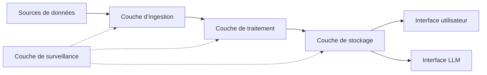

### Qu'est-ce que Markdown ?

Markdown est un langage de balisage léger qui vous permet de mettre en forme des documents en texte brut.  
Rédigez des documents pour vos projets GitHub, modifiez le fichier _README_ de votre profil GitHub, etc. Vous trouverez toutes les informations nécessaires ici.

Plongeons-nous dans le vif du sujet. ⤵️

#### Table des matières

1. [Paragraphe](#paragraphe)
2. [Titres](#titres)
3. [Mise en évidence](#miseenevidance)
4. [Citation en bloc](#citationenbloc)
5. [Images](#images)
6. [Liens](#links)
7. [Code](#code)
8. [Listes](#lists)
   - [Liste ordonnée](#orderedlist)
   - [Liste non ordonnée](#unorderedlist)
   - [Liste mixte](#mixedlist)
9. [Tableau](#table)
10. [Liste de tâches](#tasklist)
11. [Note de bas de page](#footnote)
12. [Aller à la section](#sectionjump)
13. [Ligne horizontale](#horizontalline)
14. [HTML](#html)

---

## Paragraphe

En écrivant du texte normal, vous rédigez en fait un paragraphe.

```
Ceci est un paragraphe.
```

Ceci est un paragraphe.

---

## Titres

Il existe 6 niveaux de titres. Le nombre de symboles « # », suivis de texte, indique l’importance du titre.

```
# Titre 1
## Titre 2
### Titre 3
#### Titre 4
##### Titre 5
###### Titre 6
```

# Titre 1

## Titre 2

### Titre 3

#### Titre 4

##### Titre 5

###### Titre 6

---

## Mise en évidence

Modifier le texte est très simple et pratique. Vous pouvez mettre votre texte en gras, en italique ou le barrer.

```
En utilisant deux astérisques **ce texte est en gras**.
Deux traits de soulignement __fonctionnent également__.
Mettons-le *en italique maintenant*.
Vous l’avez deviné, _un seul trait de soulignement suffit également_.
Peut-on combiner **_ces deux techniques_ ?** Bien sûr.
Et si je veux ~~barrer~~ ?
```

Avec deux astérisques, **ce texte est en gras**.  
Deux traits de soulignement **fonctionnent aussi**.  
Mettons-le _en italique maintenant_.  
Vous l’avez deviné, _un seul trait de soulignement suffit également_.  
Peut-on combiner **_les deux_ ?** Absolument.  
Et si je veux ~~barrer~~ ?

---

## Citation

Vous voulez souligner l’importance du texte ? N’en dites pas plus.

```
> Voici une citation en bloc.
> Vous voulez écrire sur une nouvelle ligne avec un espace entre les lignes ?
>
> > Et imbriquer les citations ? Aucun problème.
> >
> > > PS : vous pouvez **mettre en forme** votre texte _comme vous le souhaitez_.
```

> Voici une citation en bloc.
> Vous voulez écrire sur une nouvelle ligne avec un espace entre les lignes ?
>
> > Et imbriquer les citations ? Aucun problème.
> >
> > > PS : vous pouvez **mettre en forme** votre texte _comme vous le souhaitez_. :

---

## Images

Le plus simple est de glisser-déposer directement une image depuis votre ordinateur. Vous pouvez également créer une référence à une image et l’assigner de cette manière.  
Voici la syntaxe.

```


[logo] : chemin-automatiquement-généré-vers-le-fichier-lors-du-téléchargement-de-l'image "Passez la souris dessus"
![texte d'erreur][logo]
```


[logo] : https://user-images.githubusercontent.com/46372998/212541682-9907aaea-5198-45a9-8961-2acc8a98a0db.png « Passez la souris ici »

![texte d'erreur][logo]

---

## Liens

Tout comme les images, les liens peuvent être insérés directement ou via une référence. Vous pouvez créer des liens en ligne et des liens de bloc.

```
[markdown-cheatsheet] : https://github.com/im-luka/markdown-cheatsheet
[docs] : https://github.com/adam-p/markdown-here

[Ça vous plaît jusqu'ici ? Suivez-moi sur GitHub](https://github.com/im-luka)
[Mon aide-mémoire Markdown – ajoutez-le à vos favoris s’il vous plaît][markdown-cheatsheet]
Retrouvez d’excellentes ressources [ici][docs]
```

[markdown-cheatsheet]: https://github.com/im-luka/markdown-cheatsheet
[docs] : https://github.com/adam-p/markdown-here

[Ça vous plaît jusqu'ici ? Suivez-moi sur GitHub](https://github.com/im-luka)  
[Mon aide-mémoire Markdown - ajoutez-le à vos favoris si vous l'appréciez][markdown-cheatsheet]  
Retrouvez d’excellentes ressources [ici][docs]

---

## Code

Vous pouvez créer des extraits de code en ligne ou sous forme de blocs complets. Vous pouvez également définir le langage de programmation utilisé dans votre extrait. Tout cela en utilisant des guillemets inversés.

````
    J’ai créé un fichier `.env` à la racine.
    Des backticks à l’intérieur d’autres backticks ? `` `Pas de problème.` ``

 ```
    {
 learning: "Markdown",
 showing: "extrait de code en bloc"
    }
    ```

 ```js
    const x = "Extrait de code en bloc en JS";
    console.log(x);
    ```
````

J'ai créé un fichier `.env` à la racine.
Des backticks à l'intérieur d'autres backticks ? `` `Pas de problème.` ``

```
{
  learning: "Markdown",
  showing: "extrait de code en bloc"
}
```

```js
const x = 'Extrait de code en bloc en JS' ;
console.log(x) ;
```

---

## Listes

Tout comme en HTML, Markdown permet de créer des listes ordonnées et non ordonnées.

### Liste ordonnée

```
1. HTML
2. CSS
3. JavaScript
4. React
7. Je suis désormais développeur front-end 👨🏼‍🎨
```

1. HTML
2. CSS
3. JavaScript
4. React
5. Je suis désormais développeur front-end 👨🏼‍🎨

### Liste non ordonnée

```
- Node.js
+ Express
* Nest.js
- J'apprends le back-end ⌛️
```

- Node.js

* Express

- Nest.js

* J'apprends le back-end ⌛️

### Liste mixte

Vous pouvez également mélanger les deux types de listes et créer des sous-listes.  
**PS.** Essayez de ne pas créer de listes de plus de deux niveaux de profondeur. C'est la meilleure pratique.

```
1. Apprendre les bases
   1. HTML
   2. CSS
   7. JavaScript
2. Apprendre un framework
   - React
 - Router
 - Redux
   * Vue
   + Svelte
```

1. Apprendre les bases
   1. HTML
   2. CSS
   3. JavaScript
2. Apprendre un framework
   - React
 - Router
 - Redux
   * Vue
   - Svelte

---

## Tableau

Un excellent moyen de présenter des données bien organisées. Utilisez le symbole « | » pour séparer les colonnes et le symbole « : » pour aligner le contenu des lignes.

```
| Alignement à gauche (par défaut) | Alignement au centre | Alignement à droite |
| :------------------- | :----------: | ----------: |
| React.js | Node.js | MySQL |
| Next.js | Express | MongoDB     |
| Vue.js | Nest.js | Redis |
```

| Alignement à gauche (par défaut) | Alignement au centre | Alignement à droite |
| :------------------- | :----------: | ----------: |
| React.js |   Node.js    | MySQL |
| Next.js |   Express    |     MongoDB |
| Vue.js |   Nest.js    | Redis |

---

## Liste des tâches

Suivi des tâches terminées et de celles qui restent à faire.

```
- [x] Apprendre Markdown
- [ ] Apprendre le développement front-end
- [ ] Apprendre le développement full-stack
```

- [x] Apprendre Markdown
- [ ] Apprendre le développement front-end
- [ ] Apprendre le développement full-stack

---

## Note de bas de page

Vous souhaitez ajouter une note à la fin du fichier ? Utilisez la note de bas de page !

```
#### Je travaille sur un nouveau projet. [^1]
[^1] : La pile technologique est : React, TypeScript, Tailwind CSS

Le projet porte sur la musique et les films.

##### J'espère qu'il vous plaira. [^voir]
[^voir] : Chargement en cours.... ⌛️
```

#### Je travaille sur un nouveau projet. [^1]

[^1] : La pile technologique est la suivante : React, TypeScript, Tailwind CSS

Le projet porte sur la musique et les films.

##### J'espère qu'il vous plaira. [^voir]

[^voir] : Chargement... ⌛️

---

## Aller à la section

Astro (et la plupart des analyseurs Markdown) génère automatiquement des identifiants pour vos titres. Vous n’avez généralement pas besoin de créer manuellement des balises `<a name="...">`.

---

## Ligne horizontale

Vous pouvez utiliser des astérisques, des tirets ou des traits de soulignement (\*, -, \_) pour créer une ligne horizontale.  
La seule règle est que vous devez inclure au moins trois caractères du symbole.

```
Première ligne horizontale

***

Deuxième ligne

-----

Troisième ligne

_________
```

Première ligne horizontale

---

Deuxième ligne

---

Troisième ligne

---

---

## HTML

Vous pouvez également utiliser du code HTML brut dans votre fichier Markdown. La plupart du temps, cela fonctionnera correctement, mais vous pouvez parfois rencontrer des différences auxquelles vous n’êtes pas habitué lorsque vous travaillez avec du HTML standard. L’utilisation de CSS ne fonctionnera pas.

```
<h1>Ceci est un titre</h1>
<p>Paragraphe...</p>

<hr />


<a href="https://github.com/im-luka">Suivez-moi sur GitHub</a>

<br />
<br />

<p>Astuce rapide pour <strong><em>centrer une image</em></strong> ?</p>
<p align="center"></p>

<details>
  <summary>Encore une astuce rapide ? 🎭</summary>

  → Facile
  → Et simple
</details>
```

<h1>Ceci est un titre</h1>
<p>Paragraphe...</p>

<hr />


<a href="https://github.com/im-luka">Suivez-moi sur GitHub</a>

<br />
<br />

<p>Astuce rapide pour <strong><em>centrer une image</em></strong> ?</p>
<p align="center"></p>

<details>
  <summary>Encore une astuce rapide ? 🎭</summary>
  
  → Facile  
  → Et simple
</details>

---

## Diagrammes Mermaid

### Carte mentale

```mermaid
mindmap
  root((Test Intelligence Hub))
    Acquisition de données
 Intégration d’API
 Automatisation du navigateur
 Flux RSS
      Planification et orchestration
    Traitement des données
 Stockage des données structurées
 Traitement des données non structurées
 Intégration LLM
 Correspondance et notation
    Interface utilisateur
 Tableau de bord et visualisation
 Gestion des alertes
 Configuration et paramètres
    Infrastructure
 Surveillance et journalisation
 Gestion des erreurs
 Évolutivité
 Rentabilité
```

### Organigramme



---

##### Section avec un identifiant
