### Qu&#x27;est-ce que Markdown ?

Markdown est un langage de balisage léger que vous pouvez utiliser pour mettre en forme des documents en texte brut.  
Rédigez des documents pour vos projets GitHub, modifiez votre profil GitHub, votre fichier _README_, etc. Vous trouverez tout cela ici.

Plongeons-nous dans le vif du sujet. ⤵️

#### Table des matières

1. [Paragraphe](#paragraphe)
2. [Titres](#titres)
3. [Mise en évidence](#miseenevidance)
4. [Citation](#citation)
5. [Images](#images)
6. [Liens](#liens)
7. [Code](#code)
8. [Listes](#lists)
   - [Liste ordonnée](#orderedlist)
   - [Liste non ordonnée](#unorderedlist)
   - [Liste mixte](#mixedlist)
9. [Tableau](#table)
10. [Liste de tâches](#tasklist)
11. [Note de bas de page](#footnote)
12. [Aller à la section](#sectionjump)
13. [Ligne horizontale](#horizontalline)
14. [HTML](#html)

---

## Paragraphe

En écrivant du texte normal, vous rédigez en fait un paragraphe.

```
Ceci est un paragraphe.
```

Ceci est un paragraphe.

---

## Titres

Il existe 6 variantes de titres. Le nombre de symboles « # », suivis de texte, indique l&#x27;importance du titre.

```
# Titre 1
## Titre 2
### Titre 3
#### Titre 4
##### Titre 5
###### Titre 6
```

# Titre 1

## Titre 2

### Titre 3

#### Titre 4

##### Titre 5

###### Titre 6

---

## Mise en évidence

Modifier le texte est très simple et pratique. Vous pouvez mettre votre texte en gras, en italique ou le barrer.

```
En utilisant deux astérisques **ce texte est en gras**.
Deux traits de soulignement __fonctionnent aussi__.
Mettons-le *en italique maintenant*.
Vous l&#x27;avez deviné, _un seul trait de soulignement suffit également_.
Peut-on combiner **_les deux_ ?** Absolument.
Et si je veux ~~barrer~~ ?
```

En utilisant deux astérisques **ce texte est en gras**.  
Deux traits de soulignement **fonctionnent aussi**.  
Passons maintenant à l&#x27;_italique_.  
Vous l&#x27;avez deviné, _un seul trait de soulignement suffit également_.  
Peut-on combiner **_les deux_ ?** Absolument.  
Et si je veux ~~barrer~~ ?

---

## Citation

Vous voulez souligner l&#x27;importance du texte ? N&#x27;en dites pas plus.

```
&gt; Ceci est une citation.
&gt; Vous voulez écrire sur une nouvelle ligne avec un espace entre les lignes ?
&gt;
&gt; &gt; Et imbriquer ? Pas de problème du tout.
&gt; &gt;
&gt; &gt; &gt; PS. Vous pouvez **mettre en forme** votre texte _comme vous le souhaitez_.
```

&gt; Ceci est une citation.
&gt; Vous voulez écrire sur une nouvelle ligne avec un espace entre les lignes ?
&gt;
&gt; &gt; Et imbriqué ? Aucun problème.
&gt; &gt;
&gt; &gt; &gt; PS. Vous pouvez **mettre en forme** votre texte _comme vous le souhaitez_. :

---

## Images

La meilleure façon de procéder est simplement de glisser-déposer l&#x27;image directement depuis votre ordinateur. Vous pouvez également créer une référence à l&#x27;image et l&#x27;assigner de cette manière.  
Voici la syntaxe.

```


[logo] : chemin-automatiquement-généré-vers-le-fichier-lorsque-vous-téléchargez-l&#x27;image &quot;Survolez-moi&quot;
![texte d&#x27;erreur][logo]
```


[logo]: https://user-images.githubusercontent.com/46372998/212541682-9907aaea-5198-45a9-8961-2acc8a98a0db.png &#x27;Passez la souris ici&#x27;

![texte d&#x27;erreur][logo]

---

## Liens

Tout comme les images, les liens peuvent être insérés directement ou en créant une référence. Vous pouvez créer des liens en ligne et des liens de bloc.

```
[markdown-cheatsheet]: https://github.com/im-luka/markdown-cheatsheet
[docs]: https://github.com/adam-p/markdown-here

[Vous aimez ce que vous voyez jusqu&#x27;ici ? Suivez-moi sur GitHub](https://github.com/im-luka)
[Mon aide-mémoire Markdown - ajoutez-le à vos favoris si vous l&#x27;appréciez][markdown-cheatsheet]
Découvrez d&#x27;excellents documents [ici][docs]
```

[markdown-cheatsheet]: https://github.com/im-luka/markdown-cheatsheet
[docs] : https://github.com/adam-p/markdown-here

[Vous aimez ce que vous voyez jusqu&#x27;ici ? Suivez-moi sur GitHub](https://github.com/im-luka)  
[Mon aide-mémoire Markdown - ajoutez-le à vos favoris si vous l&#x27;appréciez][markdown-cheatsheet]  
Découvrez d&#x27;excellents documents [ici][docs]

---

## Code

Vous pouvez créer des extraits de code en ligne ou sous forme de blocs complets. Vous pouvez également définir le langage de programmation utilisé dans votre extrait. Tout cela en utilisant des guillemets inversés.

````
    J&#x27;ai créé un fichier `.env` à la racine.
    Des guillemets inversés à l&#x27;intérieur d&#x27;autres guillemets inversés ? `` `Pas de problème.` ``

    ```
    {
      learning: &quot;Markdown&quot;,
      showing: &quot;extrait de code en bloc&quot;
    }
    ```

    ```js
    const x = &quot;Extrait de code en bloc en JS&quot;;
    console.log(x);
    ```
````

J&#x27;ai créé un fichier `.env` à la racine.
Des backticks à l&#x27;intérieur d&#x27;autres backticks ? `` `Pas de problème.` ``

```
{
  learning: &quot;Markdown&quot;,
  showing: &quot;block code snippet&quot;
}
```

```js
const x = &#x27;Extrait de code en bloc en JS&#x27;;
console.log(x);
```

---

## Listes

Tout comme en HTML, Markdown permet de créer des listes ordonnées et non ordonnées.

### Liste ordonnée

```
1. HTML
2. CSS
3. Javascript
4. React
7. Je suis désormais développeur front-end 👨🏼‍🎨
```

1. HTML
2. CSS
3. Javascript
4. React
5. Je suis désormais développeur front-end 👨🏼‍🎨

### Liste non ordonnée

```
- Node.js
+ Express
* Nest.js
- Apprentissage du backend ⌛️
```

- Node.js

* Express

- Nest.js

* Apprentissage du backend ⌛️

### Liste mixte

Vous pouvez également mélanger les deux types de listes et créer des sous-listes.  
**PS.** Évitez de créer des listes de plus de deux niveaux. C&#x27;est la meilleure pratique.

```
1. Apprendre les bases
   1. HTML
   2. CSS
   7. JavaScript
2. Apprendre un framework
   - React
     - Router
     - Redux
   * Vue
   + Svelte
```

1. Apprendre les bases
   1. HTML
   2. CSS
   3. JavaScript
2. Apprendre un framework
   - React
     - Router
     - Redux
   * Vue
   - Svelte

---

## Tableau

Un excellent moyen d&#x27;afficher des données bien organisées. Utilisez le symbole « | » pour séparer les colonnes et le symbole « : » pour aligner le contenu des lignes.

```
| Alignement à gauche (par défaut) | Alignement au centre | Alignement à droite |
| :------------------- | :----------: | ----------: |
| React.js             | Node.js      | MySQL       |
| Next.js              | Express      | MongoDB     |
| Vue.js               | Nest.js      | Redis       |
```

| Alignement à gauche (par défaut) | Alignement au centre | Alignement à droite |
| :------------------- | :----------: | ----------: |
| React.js             |   Node.js    |       MySQL |
| Next.js              |   Express    |     MongoDB |
| Vue.js               |   Nest.js    |       Redis |

---

## Liste des tâches

Suivi des tâches terminées et de celles qui restent à faire.

```
- [x] Apprendre Markdown
- [ ] Apprendre le développement front-end
- [ ] Apprendre le développement full-stack
```

- [x] Apprendre Markdown
- [ ] Apprendre le développement front-end
- [ ] Apprendre le développement full-stack

---

## Note de bas de page

Vous souhaitez ajouter une note à la fin du fichier ? Utilisez la note de bas de page !

```
#### Je travaille sur un nouveau projet. [^1]
[^1]: La pile technologique est : React, Typescript, Tailwind CSS

Le projet porte sur la musique et les films.

##### J&#x27;espère qu&#x27;il vous plaira. [^voir]
[^voir]: Chargement... ⌛️
```

#### Je travaille sur un nouveau projet. [^1]

[^1] : La pile est composée de : React, Typescript, Tailwind CSS

Le projet porte sur la musique et les films.

##### J&#x27;espère qu&#x27;il vous plaira. [^voir]

[^voir] : Chargement en cours... ⌛️

---

## Aller à la section

Astro (et la plupart des analyseurs Markdown) génère automatiquement des identifiants pour vos en-têtes. Vous n&#x27;avez généralement pas besoin de créer manuellement<a name="...">
des balises</a> `<a name="...">
`.

---

## Ligne horizontale

Vous pouvez utiliser des astérisques, des tirets ou des traits de soulignement (\*, -, \_) pour créer une ligne horizontale.  
La seule règle est que vous devez inclure au moins trois caractères du symbole.

```
Première ligne horizontale

***

Deuxième ligne

-----

Troisième

_________
```

Première ligne horizontale

---

Deuxième

---

Troisième

---

---

## HTML

Vous pouvez également utiliser du code HTML brut dans votre fichier Markdown. La plupart du temps, cela fonctionnera bien, mais vous pouvez parfois rencontrer des différences auxquelles vous n’êtes pas habitué lorsque vous travaillez avec du HTML standard. L’utilisation de CSS ne fonctionnera pas.

```
<h1>Ceci est un titre</h1>
<p>Paragraphe...</p>

<hr />


<a href="https://github.com/im-luka">Suivez-moi sur GitHub</a>

<br />
<br />

<p>Une astuce rapide pour <strong><em>centrer une image</em></strong> ?</p>
<p align="center"></p>

<details>
  <summary>Encore une astuce rapide ? 🎭</summary>

  → Facile
  → Et simple
</details>
```

<h1>Ceci est un titre</h1>
<p>Paragraphe...</p>

<hr />


<a href="https://github.com/im-luka">Suivez-moi sur GitHub</a>
---

<br />
<br />

<p>Astuce rapide pour <strong><em>centrer une image</em></strong> ?</p>
<p align="center"></p>

<details>
  <summary>Encore une astuce rapide ? 🎭</summary>
  
  → Facile  
  → Et simple
</details>


## Diagrammes Mermaid

### Carte mentale

```mermaid
mindmap
  root((Test Intelligence Hub))
    Acquisition de données
      Intégration d&#x27;API
      Automatisation du navigateur
      Flux RSS
      Planification et orchestration
    Traitement des données
      Stockage de données structurées
      Traitement de données non structurées
      Intégration LLM
      Correspondance et notation
    Interface utilisateur
      Tableau de bord et visualisation
      Gestion des alertes
      Configuration et paramètres
    Infrastructure
      Surveillance et journalisation
      Gestion des erreurs
      Évolutivité
      Rentabilité
```



### Organigramme

```mermaid
flowchart LR
    A[Sources de données] --&gt; B[Couche d&#x27;ingestion]
    B --&gt; C[Couche de traitement]
    C --&gt; D[Couche de stockage]
    D --&gt; E[Interface utilisateur]
    D --&gt; F[Interface LLM]
    G[Couche de surveillance] -.-&gt; B
    G -.-&gt; C
    G -.-&gt; D
```

---

##### Section avec un identifiant</a>
